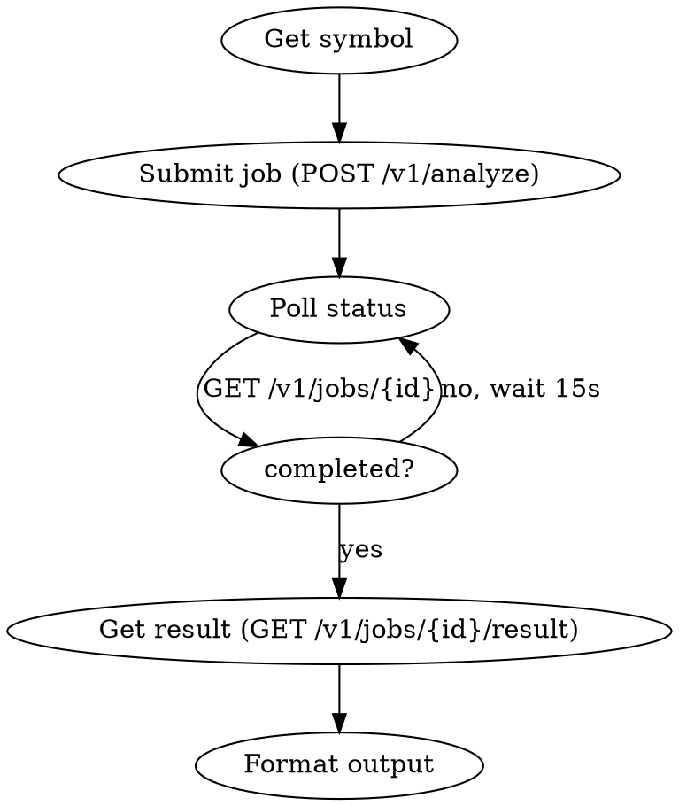

# TradingAgents Analysis Skill

Multi-agent A-share stock analysis. Submit a job, poll until done, retrieve the full report.

## Base URL & Auth

```
Base URL: $TRADINGAGENTS_API_URL  (default: https://api.510168.xyz)
Auth:     Authorization: Bearer $TRADINGAGENTS_TOKEN
Token:    Login at https://app.510168.xyz → Settings → create an API Token
```

## Workflow



## API Reference

### Submit Job
```
POST /v1/analyze
Authorization: Bearer {token}
Content-Type: application/json

{
  "symbol": "600519.SH",          // required
  "trade_date": "2025-03-12",     // optional — defaults to today
  "selected_analysts": [           // optional — defaults to 4 basic analysts
    "market", "social", "news", "fundamentals",
    "macro", "smart_money"         // add for full 6-analyst mode
  ]
}

Response: { "job_id": "abc123", "status": "pending", "created_at": "..." }
```

### Poll Job Status
```
GET /v1/jobs/{job_id}
Authorization: Bearer {token}

Response: { "job_id": "...", "status": "pending|running|completed|failed",
            "symbol": "...", "trade_date": "...", "error": null }
```

### Get Result (only when completed)
```
GET /v1/jobs/{job_id}/result
Authorization: Bearer {token}

Response: {
  "job_id": "...",
  "decision": "BUY|SELL|HOLD",
  "result": {
    "market_report": "...",
    "sentiment_report": "...",
    "news_report": "...",
    "fundamentals_report": "...",
    "macro_report": "...",
    "smart_money_report": "...",
    "game_theory_report": "...",
    "investment_plan": "...",
    "trader_investment_plan": "...",
    "final_trade_decision": "..."
  }
}
```

### Stream Events (optional, real-time)
```
GET /v1/jobs/{job_id}/events
Authorization: Bearer {token}
Accept: text/event-stream

Events: job.created | agent.status | report.chunk | job.completed | job.failed
```

## Symbol Format

A-share stocks require exchange suffix:
- Shanghai: `600519.SH`, `688xxx.SH`
- Shenzhen: `000001.SZ`, `300xxx.SZ`
- US stocks: `AAPL`, `TSLA`

Company names (e.g. "Kweichow Moutai", "贵州茅台") are resolved automatically by the API.

## Quick Implementation (Bash)

```bash
BASE="${TRADINGAGENTS_API_URL:-https://api.510168.xyz}"
TOKEN="$TRADINGAGENTS_TOKEN"

# 1. Submit
JOB=$(curl -s -X POST "$BASE/v1/analyze" \
  -H "Authorization: Bearer $TOKEN" \
  -H "Content-Type: application/json" \
  -d '{"symbol":"600519.SH","selected_analysts":["market","social","news","fundamentals","macro","smart_money"]}')
JOB_ID=$(echo $JOB | python3 -c "import sys,json; print(json.load(sys.stdin)['job_id'])")
echo "Job: $JOB_ID"

# 2. Poll until done
while true; do
  STATUS=$(curl -s "$BASE/v1/jobs/$JOB_ID" -H "Authorization: Bearer $TOKEN" \
    | python3 -c "import sys,json; print(json.load(sys.stdin)['status'])")
  echo "Status: $STATUS"
  [ "$STATUS" = "completed" ] && break
  [ "$STATUS" = "failed" ] && echo "Failed!" && exit 1
  sleep 15
done

# 3. Get result
curl -s "$BASE/v1/jobs/$JOB_ID/result" -H "Authorization: Bearer $TOKEN" \
  | python3 -m json.tool
```

## Output Format

When analysis completes, summarize:
1. **Decision**: BUY / SELL / HOLD (from `decision` field)
2. **Final verdict**: excerpt from `final_trade_decision` (first 500 chars)
3. **Analyst views**: one-line summary per report section
4. Offer to show the full report for any specific section

## Common Mistakes

| Mistake | Fix |
|---|---|
| 409 on GET /result | Job not done yet — keep polling |
| Symbol without suffix | Add .SH or .SZ based on code prefix |
| Empty reports | Some analysts need `macro`/`smart_money` in selected_analysts |
| Token expired | Re-login at https://app.510168.xyz → Settings → create a new API Token |
